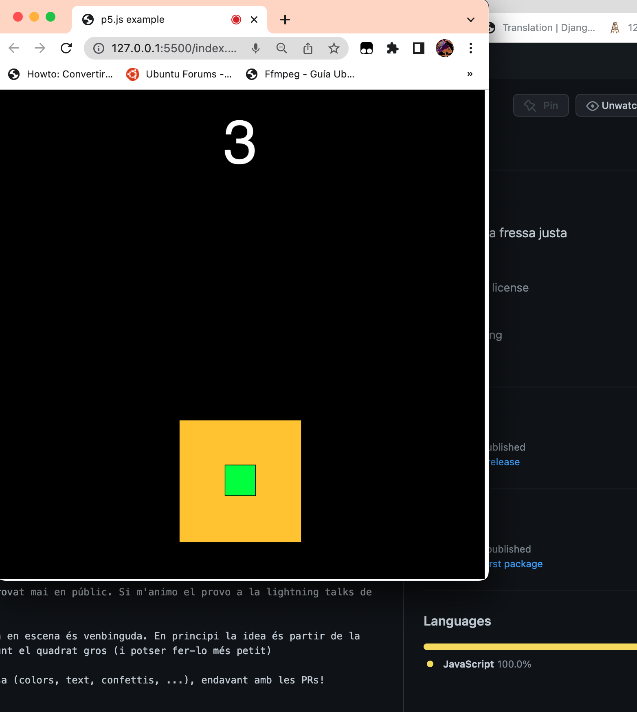

# FRESA

Fressa és tan sols un joc. Fent fressa cal encaixar el quadrat petit dins el gros durant 5 segons seguits.

Aquest joc el vaig picar ahir a la nit i no l'he provat mai en públic. Si m'animo el provo a la lightning talks de https://hacktoberfest.geeks.cat/.

Qualsevol suggeriment, idea o ajuda per a la posada en escena és venbinguda. En principi la idea és partir de la configuració inicial i anar posant cada cop més amunt el quadrat gros (i potser fer-lo més petit)

Si el proves i creus que es pot millorar alguna cosa (colors, text, confettis, ...), endavant amb les PRs!

El codi està fet amb JS i p5.js

Per executar-lo faig servir [Visual Studio Code](https://code.visualstudio.com/) amb el pluggin [Live Server](https://marketplace.visualstudio.com/items?itemName=ritwickdey.LiveServer)

## Problemes coneguts

Degut a que el programa fa servir el subsistema d'audio, cal fer clic per iniciar-lo (els navegadors no volen iniciar el subsistema audio automàticament per evitar spam) Li cal un missatge que ho indiqui (mirar issues)

## Screenshot

# License

* The p5.js library is free software; you can redistribute it and/or modify it under the terms of the GNU Lesser General Public License as published by the Free Software Foundation, version 2.1.
* Fressa té llicència MIT.
